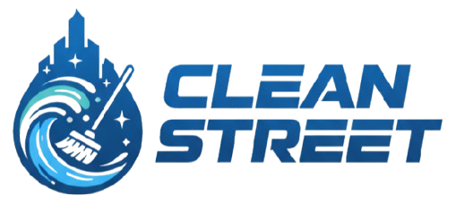
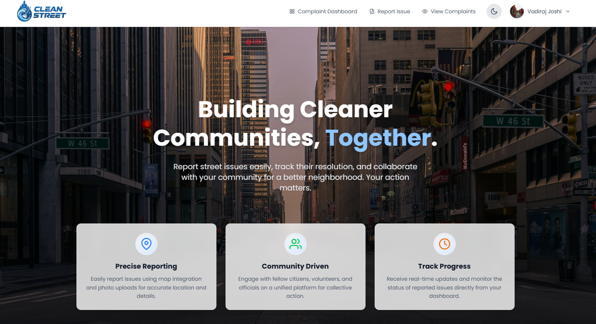

# 🌟 Clean Street

<div align="center">



**A Smart Civic Engagement Platform for Reporting and Managing Street Cleanliness Issues**

[](https://reactjs.org/)
[](https://nodejs.org/)
[](https://www.mongodb.com/)
[](https://tailwindcss.com/)

*Developed as part of Infosys Springboard Virtual Internship 6.0*

</div>

---

## 📖 Overview

Clean Street is a comprehensive web application that empowers citizens to report street cleanliness issues, track their resolution, and engage with their community. The platform bridges the gap between citizens, volunteers, and administrators to create cleaner, more livable urban spaces.

### ✨ Key Features

- 🗺️ **Interactive Map-Based Reporting** - Report issues with precise geolocation using Leaflet maps
- 📸 **Photo Upload** - Attach visual evidence via Cloudinary integration
- 👥 **Role-Based Access Control** - Separate dashboards for Users, Volunteers, and Admins
- 📊 **Real-Time Analytics** - Track complaint statistics and resolution trends
- 💬 **Community Engagement** - Comment system with upvote/downvote functionality
- 🔔 **Status Tracking** - Monitor complaint lifecycle from submission to resolution
- 📱 **Responsive Design** - Seamless experience across all devices
- 📄 **PDF Export** - Generate reports for complaints

---

## 🛠️ Tech Stack

### Frontend
- **Framework:** React 19.1.1 with Vite
- **Styling:** TailwindCSS 4.1
- **Routing:** React Router DOM 7.9
- **Maps:** Leaflet & React-Leaflet
- **Charts:** Recharts
- **UI/UX:** React Icons, React Hot Toast
- **PDF Generation:** jsPDF

### Backend
- **Runtime:** Node.js with Express 5.1
- **Database:** MongoDB with Mongoose ODM
- **Authentication:** JWT (JSON Web Tokens)
- **Password Security:** bcrypt
- **File Upload:** Multer with Cloudinary
- **CORS:** Enabled for cross-origin requests

---

## 🏗️ Project Structure

```
clean-street/
├── frontend/                 # React frontend application
│   ├── src/
│   │   ├── Components/      # Reusable UI components
│   │   ├── pages/           # Page components
│   │   ├── context/         # React context providers
│   │   └── utils/           # API utilities
│   └── public/              # Static assets
│
├── backend/                 # Express backend API
│   ├── controller/          # Route controllers
│   ├── models/              # MongoDB schemas
│   ├── routes/              # API routes
│   ├── middleware/          # Auth & upload middleware
│   └── .config/             # Configuration files
│
└── README.md
```

---

## 🚀 Getting Started

### Prerequisites

Ensure you have the following installed:
- [Node.js](https://nodejs.org/) (v16 or later)
- [MongoDB](https://www.mongodb.com/) (local or Atlas)
- npm or yarn package manager

### Installation

#### 1️⃣ Clone the Repository

```bash
git clone https://github.com/yourusername/clean-street.git
cd clean-street
```

#### 2️⃣ Backend Setup

```bash
cd backend

# Install dependencies
npm install

# Create environment file
cp .env.example .env
```

**Configure `.env` file:**

```env
MONGO_URL=mongodb://localhost:27017/CleanStreet
PORT=3002
JWT_USER_SECRET=your_secure_user_secret_key
JWT_ADMIN_SECRET=your_secure_admin_secret_key
NODE_ENV=development
CLOUDINARY_CLOUD_NAME=your_cloudinary_cloud_name
CLOUDINARY_API_KEY=your_cloudinary_api_key
CLOUDINARY_API_SECRET=your_cloudinary_api_secret
```

**Start the backend server:**

```bash
npm start
```

Server will run on `http://localhost:3002`

#### 3️⃣ Frontend Setup

```bash
cd frontend

# Install dependencies
npm install

# Create environment file
cp .env.example .env
```

**Configure `.env` file:**

```env
VITE_BACKEND_URL=http://localhost:3002
```

**Start the development server:**

```bash
npm run dev
```

Frontend will run on `http://localhost:5173`

---

## 📱 Application Features

### 🔐 User Roles

#### **Citizens (Users)**
- Register and create personal profiles
- Report street cleanliness issues with photos and location
- Track complaint status in real-time
- Upvote/downvote complaints
- Add comments and engage with community
- View all complaints on interactive map

#### **Volunteers**
- Access dedicated volunteer dashboard
- View assigned complaints
- Update complaint status
- Communicate with citizens via comments
- Track resolution progress

#### **Administrators**
- Comprehensive admin dashboard with analytics
- Manage all complaints and users
- Assign complaints to volunteers
- View statistics and trends
- Approve or reject complaints
- Monitor system activity logs

### 🗂️ Complaint Categories

- 🗑️ **Garbage** - Waste accumulation and disposal issues
- 🛣️ **Road Damage** - Potholes, cracks, and road deterioration
- 💡 **Street Light** - Non-functional or damaged street lighting
- 💧 **Water Leakage** - Pipe bursts and water wastage

### 📊 Priority Levels

- 🔴 **High** - Urgent issues requiring immediate attention
- 🟡 **Medium** - Important issues with moderate urgency
- 🟢 **Low** - Minor issues that can be scheduled

---

## 🔌 API Endpoints

### Authentication
- `POST /api/auth/register` - User registration
- `POST /api/auth/login` - User login
- `POST /api/auth/logout` - User logout

### Users
- `GET /api/user/profile` - Get user profile
- `PUT /api/user/profile` - Update user profile
- `GET /api/user/all` - Get all users (Admin)

### Complaints
- `POST /api/complaints` - Create new complaint
- `GET /api/complaints` - Get all complaints
- `GET /api/complaints/:id` - Get complaint by ID
- `PUT /api/complaints/:id` - Update complaint
- `DELETE /api/complaints/:id` - Delete complaint
- `POST /api/complaints/:id/upvote` - Upvote complaint
- `POST /api/complaints/:id/downvote` - Downvote complaint

### Comments
- `POST /api/comments` - Add comment to complaint
- `GET /api/comments/:complaintId` - Get comments for complaint

### Volunteers
- `GET /api/volunteer/assigned` - Get assigned complaints
- `PUT /api/volunteer/update/:id` - Update complaint status

### Admin
- `GET /api/admin/statistics` - Get system statistics
- `PUT /api/admin/assign/:id` - Assign complaint to volunteer
- `GET /api/admin/logs` - Get admin activity logs

---

## 🎨 Screenshots

<div align="center">

### Landing Page


### Interactive Map
*Citizens can pinpoint exact locations of issues*

### Dashboard
*Role-specific dashboards for Users, Volunteers, and Admins*

</div>

---

## 🔒 Security Features

- JWT-based authentication with secure token storage
- Password hashing using bcrypt
- Role-based access control (RBAC)
- CORS configuration for secure cross-origin requests
- Environment variable protection for sensitive data
- Cookie-based session management

---

## 🌐 Deployment

### Frontend (Vercel)
The frontend is deployed on Vercel and accessible at:
- Production: `https://clean-street.vercel.app`

### Backend
Configure CORS origins in `server.js` to include your production URL.

---

## 🤝 Contributing

Contributions are welcome! Please follow these steps:

1. Fork the repository
2. Create a feature branch (`git checkout -b feature/AmazingFeature`)
3. Commit your changes (`git commit -m 'Add some AmazingFeature'`)
4. Push to the branch (`git push origin feature/AmazingFeature`)
5. Open a Pull Request

---

## 📝 License

This project is developed as part of the Infosys Springboard Virtual Internship 6.0.

---

## 👥 Authors

Developed with ❤️ by the Clean Street Team

---

## 🙏 Acknowledgments

- **Infosys Springboard** for the internship opportunity
- **OpenStreetMap** for map data via Leaflet
- **Cloudinary** for image hosting services
- The open-source community for amazing tools and libraries

---

## 📧 Contact

For questions or support, please open an issue in the GitHub repository.

---

<div align="center">

**Made with ❤️ for cleaner, better cities**

⭐ Star this repository if you find it helpful!

</div>
